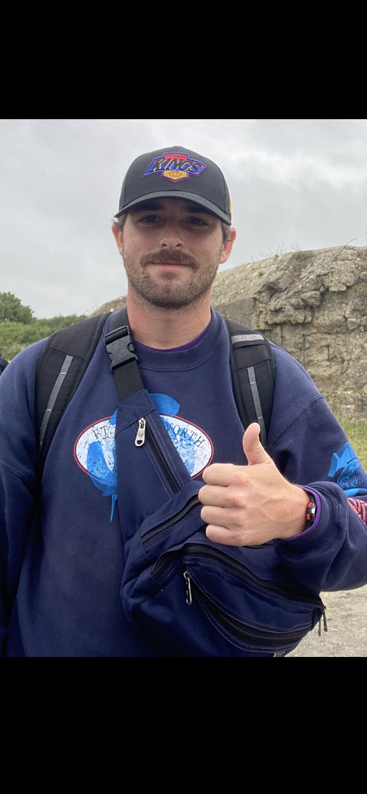

<!-- HOME: replace the name, introduction, and email below. Keep the ::: layout lines. -->
:::: {.home-hero}
::: {.hero-copy}
[STUDENT / TEACHER / EXPLORER]{.eyebrow}

# Johnny Amato {.display-name}

[One day at a time.]{.hero-subtitle}

I'm an undergraduate student at Loyola Marymount University studying political science and I have been a preschool teacher at the Plymouth School in Los Angeles for the last six years. This is a place for my projects, the questions I'm working through, and a few notes from beyond the classroom.

[Explore my research](research.qmd){.primary-link} [Say hello](mailto:yohnnyamato@gmail.com){.quiet-link}
:::

::: {.hero-photo}
<!-- Replace images/profile.jpg with your photo. Update the description in fig-alt too. -->
{fig-alt="Crazy day at Point Du Hoc."}
:::
::::

:::: {.home-notes}
::: {.home-note}
[01 / OUT IN THE WORLD]{.eyebrow}

## Questions we may ask

How do our lived experiences change how we look at the world? How do people view the world outside of themselves? Join me while I try to answer these questions in my project sections.

[Academic interests & research](research.qmd)
:::

::: {.home-note}
[02 / THE INNER MACHINATIONS]{.eyebrow}

## These thoughts of mine 

To make sense of the world around me, it helps to put my thoughts to words. Whether I'm venting about a bad day, acknowledging an achievement or just working on some creative writing, its going in my blog section

[Check out my blog here](blog.qmd)
:::
::::
