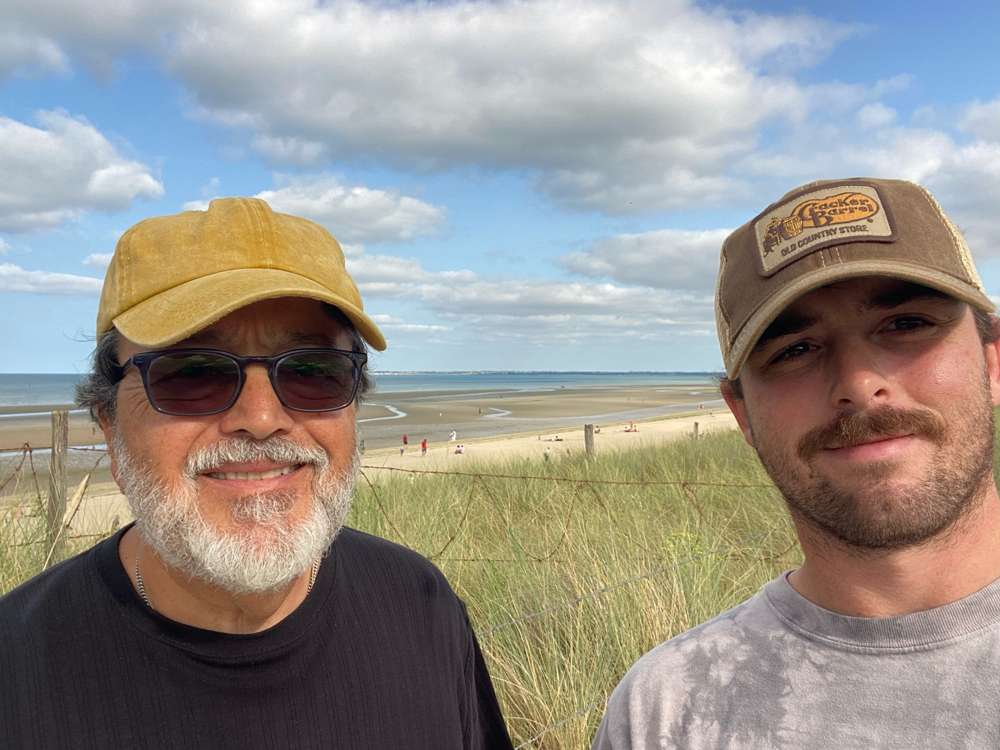
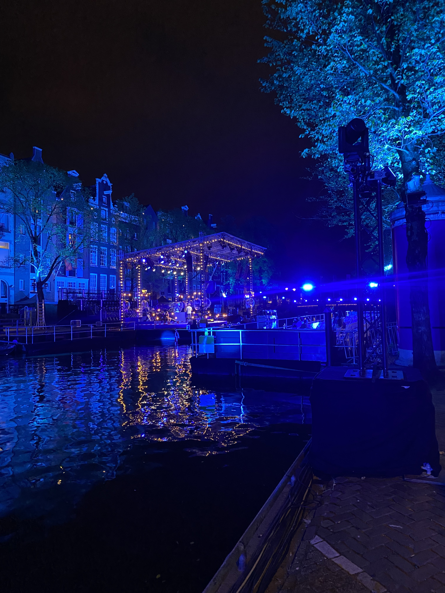

<!-- TRAVEL: replace the image, location, and short reflection with your own. -->

{.travel-photo fig-alt="A day at Utah beach in Normandy with my father."}

## NORMANDY

[FIELD NOTES / A DIFFERENT PACE]{.project-label}

Talk about a place with some history. In 2024, my father and I traveled to Normandy, France to see the D-Day beaches.

## What I want to remember

- The details that a photograph doesn't capture.
- A question about the place or the people who live there.
- Something I would notice differently on a return visit.

<!-- Add another place by copying the image and heading pattern above. -->

{.travel-photo fig-alt="Gorontalostraat at night overlooking a scenic canal."}

## AMSTERDAM

[FIELD NOTES / A DIFFERENT PACE]{.project-label}

In 2022, I visited a friend who moved from Rome to Amsterdam. I toured the city for a few weeks while meeting some incredible people. 

[More observations on the blog](blog.qmd)